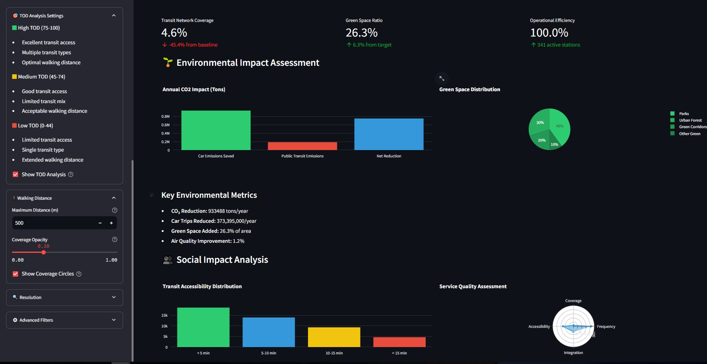

# TOD-Simulator 🌆

A powerful Transit-Oriented Development (TOD) Simulator for urban planning and analysis, designed to help urban planners and developers make data-driven decisions for sustainable city development.

## 🚀 Overview

TOD-Simulator is a comprehensive tool that analyzes and visualizes Transit-Oriented Development opportunities in urban areas. It helps stakeholders understand the potential for development around transit stations by considering multiple factors such as walkability, land use, and transit accessibility.

### 📸 Application Preview


*Main dashboard showing transit station analysis and coverage areas*



*Detailed visualization of transit networks and development metrics*

## ✨ Key Features

- **Interactive Transit Visualization**
  - Real-time visualization of transit stations and coverage areas
  - Multi-layer mapping system
  - Dynamic heat maps for various metrics

- **Advanced Analytics**
  - TOD score calculation based on international standards
  - Walkability analysis with isochrone mapping
  - Land use optimization recommendations
  - Density and diversity metrics

- **Transit Support**
  - Metro stations and lines
  - Bus networks and stops
  - Tram systems
  - Railway stations
  - Multi-modal integration analysis

- **Data Analysis**
  - Real-time filtering and sorting
  - Custom report generation
  - Data export capabilities
  - Historical trend analysis

## 🛠️ Installation

1. Clone the repository:
```bash
git clone https://github.com/BasselDar/TOD-Simulator.git
cd TOD-Simulator
```

2. Install dependencies:
```bash
pip install -r requirements.txt
```

3. Run the application:
```bash
streamlit run app.py
```

## 📊 Data Sources

The simulator leverages comprehensive OpenStreetMap (OSM) data for Egypt, including:
- Transit stations and stops
- Railway networks and infrastructure
- Road networks and traffic patterns
- Land use and zoning information
- Building footprints and heights
- Points of interest (POIs)

## 💡 Use Cases

- Urban Planning Departments
- Transit Authorities
- Real Estate Developers
- Urban Research Institutions
- City Planning Consultants
- Environmental Impact Assessment

## 📫 Contact

For questions, suggestions, or collaboration opportunities:
- Email: basseldar66@gmail.com
- GitHub Issues: [Create an issue](https://github.com/BasselDar/TOD-Simulator/issues)


## 🤝 Contributing

Contributions are welcome! Please feel free to submit a Pull Request.

1. Fork the project
2. Create your feature branch (`git checkout -b feature/AmazingFeature`)
3. Commit your changes (`git commit -m 'Add some AmazingFeature'`)
4. Push to the branch (`git push origin feature/AmazingFeature`)
5. Open a Pull Request

